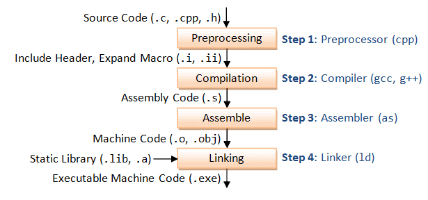

# Program
* biraz teori
* çokca demo
* süre kalırsa pwn

# Tersine mühendislik?
* liveoverflow binary exp serisi -> https://www.youtube.com/watch?v=iyAyN3GFM7A&list=PLhixgUqwRTjxglIswKp9mpkfPNfHkzyeN
* cryptocat -> https://www.youtube.com/watch?v=wa3sMSdLyHw&list=PLHUKi1UlEgOIc07Rfk2Jgb5fZbxDPec94
# C?
# example_c_program
## ascii string, hex

* https://godbolt.org/
* https://godbolt.org/z/nG5Tj6Gnc

## sycalls
* strace
* https://syscalls.w3challs.com/?arch=x86_64

# asm?

* https://gchq.github.io/

* https://godbolt.org/z/e5YK1Tc93
* https://disasm.pro/
* https://syscalls.w3challs.com/?arch=x86_64

# machine code

# compiler, linker, machine code

main.c --(gcc)--> main.s --(as)-->  main.o --(ldd)--> main

# process

c -> asm -> machine

machine --(dissassemble)--> asm --(decompile)--> c

# setup
gdb, gef, tmux, pwntools, idafreeware, ghidra, binaryninja demo

# demos

## gdb
gef, x, print, ni, si, break, disas,

## decomp tools
idafree, ninja, ghidra, r2

## licence1
## licence2
## licence3
### z3
* https://ericpony.github.io/z3py-tutorial/guide-examples.htm

# pwn
https://exploit.education/downloads/

https://github.com/le91688/**protostar**

